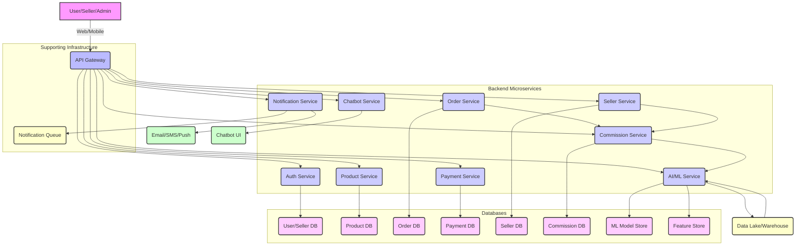
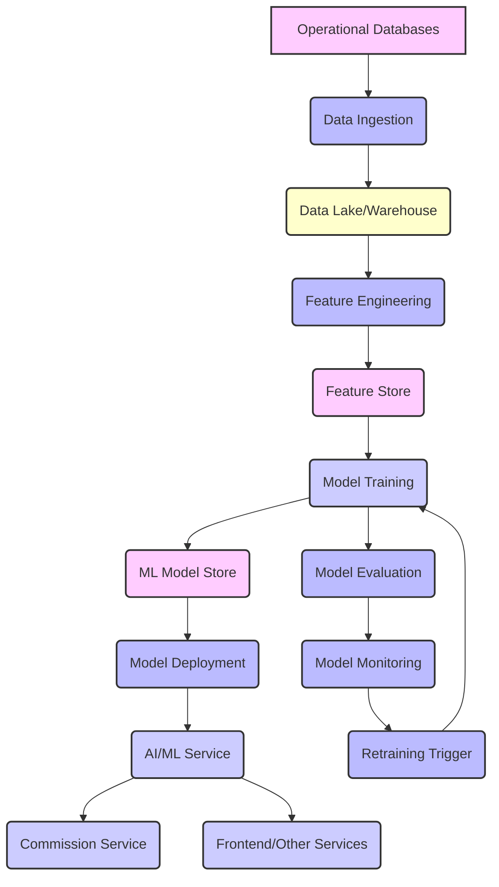

# RefCommerce: AI-Driven Dynamic Commission E-commerce Platform Design

## 1. Architecture Overview

This section outlines the high-level system architecture for the RefCommerce platform, designed to support dynamic AI-driven commissions, comprehensive seller management, and an intuitive user experience. The architecture follows a modular, service-oriented design, emphasizing scalability, resilience, and maintainability. It comprises distinct layers for frontend, backend microservices, database management, AI/ML pipelines, and supporting infrastructure.

### 1.1. High-Level System Architecture

At its core, RefCommerce is a cloud-native application leveraging a microservices pattern. This approach allows for independent development, deployment, and scaling of individual services, ensuring agility and fault isolation. The system is accessible via a unified API Gateway, which acts as the single entry point for all client applications, including the user-facing frontend, seller dashboards, and admin CRM.

### 1.2. Frontend Architecture

The frontend consists of three primary applications, all built using modern JavaScript frameworks (e.g., React, Vue, or Angular) to ensure a responsive and dynamic user experience. Each application communicates with the backend via the API Gateway.

*   **User-Facing E-commerce Website**: This is the primary customer interface, allowing users to browse products, add to cart, make purchases, and manage their profiles. It will integrate AI features like product recommendations, visual search, and the interactive chatbot.
*   **Seller Dashboard**: A dedicated portal for sellers to manage their products, view sales performance, track commissions, manage orders, and access performance insights provided by the AI model. This dashboard will offer transparency into the dynamic commission calculation.
*   **Admin CRM**: An internal tool for platform administrators to manage users, sellers, products, orders, disputes, and commissions. It will provide capabilities for manual commission overrides, audit logs, and anomaly alerts from the fraud detection service.

### 1.3. Backend Microservices

The backend is composed of several independent microservices, each responsible for a specific business domain. This separation ensures loose coupling, allowing teams to develop and deploy services autonomously. All services will be built using Python (FastAPI/Flask) for rapid development and efficient performance.

*   **Auth Service**: Handles user and seller authentication (login, registration), authorization (JWT-based), and profile management. It integrates with the User/Seller Database.
*   **Product Service**: Manages product listings, categories, inventory, and search functionalities. It interacts with the Product Database.
*   **Order Service**: Processes order creation, status updates, fulfillment tracking, and order history. It communicates with the Order Database and triggers events for the Payment and Commission Services.
*   **Payment Service**: Manages payment processing, refunds, and payout calculations. It integrates with third-party payment gateways and the Payment Database.
*   **Seller Service**: Manages seller profiles, onboarding, verification, and performance metrics. It interacts with the Seller Database and provides data to the Commission and AI/ML Services.
*   **Commission Service**: Calculates and manages dynamic commissions based on rules and AI model outputs. It interacts with the Commission Database and receives data from the Order and Seller Services.
*   **AI/ML Service**: A central service hosting various AI models, including the dynamic commission prediction model, recommendation engine, visual search, and fraud detection. It consumes data from the Data Lake/Warehouse and provides predictions/insights to other services.
*   **Notification Service**: Handles sending notifications (email, SMS, push) to users, sellers, and admins based on system events (e.g., order confirmation, commission updates, fraud alerts). It uses a Notification Queue for asynchronous processing.
*   **Chatbot Service**: Provides the interactive AI chatbot functionality, processing natural language queries and generating responses. It may integrate with other services to retrieve information (e.g., product details, order status).

### 1.4. Database Architecture

Each microservice will ideally have its own dedicated database to enforce data ownership and autonomy. For simplicity and initial implementation, a relational database like PostgreSQL or MySQL will be used, with separate schemas or instances for each service's data. A dedicated Data Lake/Warehouse will be used for collecting and processing data for AI/ML model training and analytics.

*   **User/Seller DB**: Stores user and seller authentication credentials and profile information.
*   **Product DB**: Stores product details, inventory, and categorization.
*   **Order DB**: Stores order details, line items, and order status.
*   **Payment DB**: Stores payment transactions and payout records.
*   **Commission DB**: Stores commission rates, history, and related metrics.
*   **ML Model Store**: Stores trained AI/ML models and their versions.
*   **Feature Store**: Stores pre-computed features for AI/ML models, ensuring consistency between training and inference.
*   **Data Lake/Warehouse**: A centralized repository for raw and processed data from all services, used for analytics, reporting, and AI/ML model training.

### 1.5. AI/ML Pipeline

The AI/ML pipeline is critical for the dynamic commission system and other intelligent features. It encompasses data ingestion, feature engineering, model training, deployment, and monitoring.

*   **Data Ingestion**: Real-time and batch ingestion of operational data (sales, orders, seller performance, customer interactions) from various microservices into the Data Lake/Warehouse.
*   **Feature Engineering**: Transformation of raw data into features suitable for ML models (e.g., seller GMV, return rate, customer rating averages, support ticket counts). These features are stored in a Feature Store for consistency.
*   **Model Training**: Training of the dynamic commission prediction model and other AI models (recommendation, fraud detection) using historical data. This process will be automated and potentially run on a scheduled basis or triggered by performance degradation.
*   **ML Model Store**: A repository for versioning and managing trained ML models.
*   **Model Deployment**: Deployment of trained models as API endpoints via the AI/ML Service, making them available for real-time inference by other services.
*   **Model Evaluation & Monitoring**: Continuous evaluation of model performance (e.g., prediction accuracy, fairness metrics) and monitoring for data drift or concept drift. Alerts will be triggered for significant performance degradation.
*   **Retraining Trigger**: Automated triggers for model retraining based on performance metrics, data changes, or a predefined schedule.

### 1.6. Data Sources and Queues

*   **Operational Databases**: Primary data sources for each microservice.
*   **Data Lake/Warehouse**: Centralized repository for analytical and ML data.
*   **Message Queues (e.g., Kafka, RabbitMQ)**: Used for asynchronous communication between services, enabling event-driven architecture. Examples include:
    *   Order completion events (Order Service to Payment/Commission Service)
    *   Seller performance updates (Seller Service to AI/ML Service)
    *   Notification triggers (any service to Notification Service)
*   **External APIs**: Integration with third-party services like payment gateways, SMS/email providers, and potentially external data sources for market trends or competitive analysis.

This architecture provides a robust and flexible foundation for the RefCommerce platform, capable of supporting its core e-commerce functionalities while enabling advanced AI-driven features for dynamic commission management and enhanced user experiences. The modular design ensures that new features can be added and existing ones scaled independently, adapting to future business needs.

